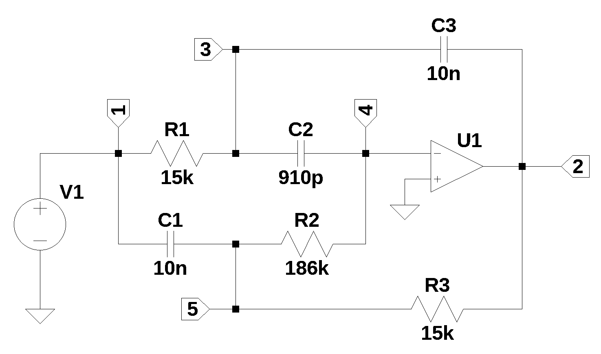

This JupyterLab notebook walks through some of the analysis found in the paper, [A Bandpass Twin-T Active Filter Used in the Buchla 200 Electric Music Box Synthesizer](https://arxiv.org/abs/2411.11358). The paper describes a third order bandpass filter (BPF) employed in the Buchla Model 295 10 Channel Comb Filter, a synthesizer module developed as part of the Buchla 200 Electric Music Box. The BPF described has a unique arrangement of elements not found in the typical Twin-T configuration, which makes this BPF a interesting candiditate to study.

***Abstract***: This report is an analysis of a band pass filter using Symbolic Modified Nodal Analysis implemented with Python in a JupyterLab Notebook then rendered into a PDF. The report builds on the work, *A Bandpass Twin-T Active Filter Used in the Buchla 200 Electric Music Box Synthesizer*, by Aaron D. Lanterman. The report continues with related analysis, thoughts and observations about the filter topology. The use of SymPy makes generating the node equations and obtainig analalytic solutions for the node voltages almost efferortless.

{width=600}

